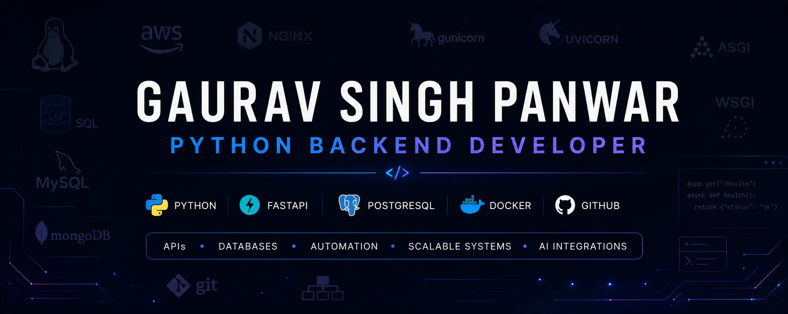

<div align="center">



<br><br>


<br><br>


</div>

---

# 👋 Hi, I'm Gaurav Singh Panwar

## 🚀 Python Backend Engineer

I build **scalable backend systems and production-grade APIs** using Python ecosystem.

💡 Focus Areas:
- Backend Engineering (FastAPI, Flask)
- System Design & Architecture
- AI Automation & LLM Integrations
- Scalable Microservices
- Database Design (SQL + NoSQL)

🎯 Goal:
To become a high-level backend engineer building **real-world SaaS + AI-driven systems**.

# 🚀 About Me

```python
class GauravPanwar:

    def __init__(self):
        self.role = "Python Backend Developer"
        self.focus = [
            "Backend Engineering",
            "Scalable API Development",
            "AI Automation",
            "System Design"
        ]

        self.current_stack = {
            "Backend": ["Python", "FastAPI", "Flask", "SQLAlchemy", "Alembic"],
            "Database": ["SQL", "PostgreSQL", "MySQL", "MongoDB"],
            "Infrastructure": ["Docker", "Redis", "Nginx", "Gunicorn", "Uvicorn"],
            "Tools": ["Git", "GitHub", "Linux", "Postman"]
        }

    def career_goal(self):
        return "Building scalable production-grade backend systems"
```

---

# 🛠️ Tech Stack

<div align="center">

### Backend & Infrastructure

<p align="center">
  
<br>

```text
Python • Flask • FastAPI • Docker • Redis • Linux
```

---

### Databases

<p align="center">


</p>

```text
SQL • PostgreSQL • MySQL • MongoDB • ORM:SQLAlchemy
```

---

### Tools & Development

<p align="center">
  
</p>

```text
Git • GitHub • VS Code • Postman • React • Tailwind CSS
```

</div>

---

# 📚 Learning / Exploring

- Backend Architecture
- Scalable API Design
- Redis & Celery
- AI & LLM Integrations
- Automation Systems
- Deployment Workflows
- System Design
- ASGI / WSGI Concepts

---

# 📌 Featured Projects

## 🏥 MEDiFLOW — Hospital Management System

Backend-focused hospital management system designed to practice real-world backend architecture and scalable API development.

### Highlights

- Authentication workflows
- PostgreSQL integration
- Dockerized backend setup
- SQLAlchemy & Alembic integration
- Structured FastAPI architecture

### Tech Stack

```bash
FastAPI • PostgreSQL • Docker • SQLAlchemy
```

---

## 🐍 Snake Game

Classic snake game project built for programming logic and development practice.

---

## 🧮 Calculator Project

Simple calculator application created while strengthening programming fundamentals.

---

# 📈 GitHub Stats

<div align="center">


<br><br>


</div>

---

# 🎯 Career Goal

To become a high-level backend engineer specializing in:

- Scalable backend systems
- AI automation
- Production-grade architecture
- Real-world SaaS applications
- High-performance API development

---

# 📫 Connect With Me

<div align="center">

<a href="https://github.com/gauravpanwar08">

</a>

<a href="https://www.linkedin.com/in/gauravpanwar08">

</a>

<a href="[YOUR_PORTFOLIO_LINK](https://gaurav-portfolio-puce.vercel.app/)">

</a>

</div>

---

<div align="center">

### ⚡ Building real systems. Solving real problems.

</div>


<div align="center">


### ⚡ Happy Coding! 
</div>
